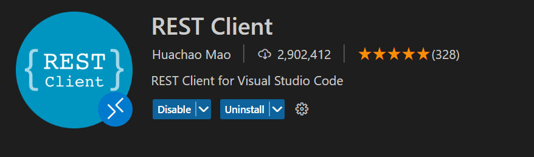

# Elastic Path Commerce Cloud VSCode REST examples

*If you are looking for the postman collection you can find it in the documentation [https://documentation.elasticpath.com/commerce-cloud/docs/api/index.html#postman](https://documentation.elasticpath.com/commerce-cloud/docs/api/index.html#postman).*

This repository contains a collection of files to assist in making commerce cloud API calls through the [VSCode REST client extension](https://marketplace.visualstudio.com/items?itemName=humao.rest-client).

## About

Postman, Insomnia, and Fiddler are excellent tools for calling an API, but they are standalone applications. VSCode users already have VSCode open and running. The VSCode REST extension is fully open-source and allows developers to make API calls directly from VSCode with a minimal interface.

The calls are stored in *.http or 8.rest files and can be committed to a repository and easily shared with the entire development team.

This repository has example requests to get you running with the Commerce Cloud API and the VSCode REST extension.

## Setup

### Requirements

 - [VSCode](https://code.visualstudio.com/)
 - [VSCode REST Client Extension](https://marketplace.visualstudio.com/items?itemName=humao.rest-client)

 

  - Create a .vscode/settings.json
  - Configure Commerce Cloud store settings
  - Execute calls in example.http

<!-- Add youtube video here -->